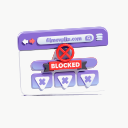
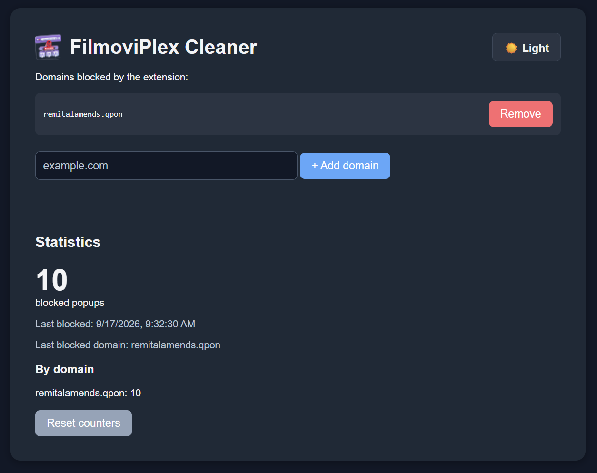
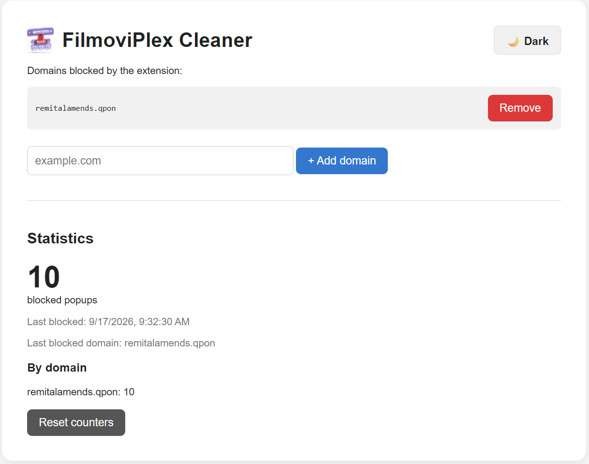

# FilmoviPlex Cleaner

A Brave/Chrome browser extension that blocks unwanted popup domains associated with FilmoviPlex pages.

## Icon

## What it does

This extension:

- blocks configured domains from loading on FilmoviPlex pages
- tracks how many blocks occur
- shows the most recent blocked domain in the options page
- lets you add or remove blocked domains from the extension settings
- supports dark and light theme in the options screen

## Files

- `background.js` — background service worker that stores settings and applies dynamic network rules
- `blocker.js` — main-world script that watches page traffic and reports blocked content
- `bridge.js` — isolated-world bridge that relays messages from the page to the extension
- `options.html` — extension settings page
- `options.js` — settings page logic, counts, theme toggle, and last-blocked-domain handling
- `manifest.json` — extension manifest and permissions
- `icons/` — icon assets

## Installation

1. Open Brave and go to `brave://extensions`.
2. Enable Developer mode.
3. Click Load unpacked.
4. Select this project folder.

## Usage

1. Open the extension options page.
2. Add domains you want blocked.
3. Visit FilmoviPlex pages and the extension will automatically block matching popup traffic.

## Default domain

The extension starts with this domain blocked by default:

- `remitalamends.qpon`

## Screenshots

### Options page

#### Dark

#### Light

### Extension icon in browser

## Notes

- The extension uses Chrome extension APIs such as `chrome.storage` and `chrome.declarativeNetRequest`.
- The options page keeps compact stats like `1k`, `1.1k`, and `1M` for large numbers.
