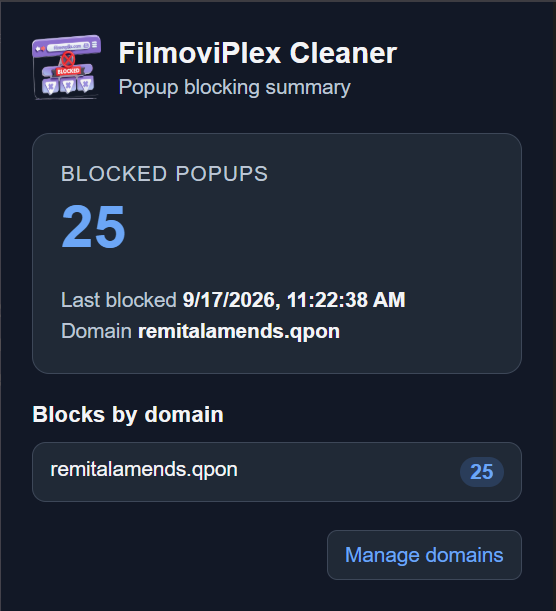

# FilmoviPlex Cleaner

A Chromium-based browser extension that blocks unwanted popup domains associated with FilmoviPlex pages. It is designed to work in Brave, Google Chrome, Microsoft Edge, Opera, Vivaldi, and other Manifest V3-compatible Chromium browsers.

## Icon

## What it does

This extension is specifically designed to block popup domains that often bypass Brave Shields, DuckDuckGo Privacy Protection, and other general popup/ad blockers.

This extension:

- blocks configured domains from loading on FilmoviPlex pages
- catches popup traffic that standard browser shields and ad blockers can miss
- tracks how many blocks occur
- shows blocking statistics when the extension toolbar icon is clicked
- shows the most recent blocked domain in the popup and options page
- lets you add or remove blocked domains from the extension settings
- follows the browser's light or dark theme automatically in the popup
- supports dark and light theme in the options screen

> Important: this extension targets popup domains used by FilmoviPlex pages and can block sources that Brave Shields, DuckDuckGo shields, and other generic popup/ad blockers do not reliably stop.

## Files

- `background.js` — background service worker that stores settings and applies dynamic network rules
- `blocker.js` — main-world script that watches page traffic and reports blocked content
- `bridge.js` — isolated-world bridge that relays messages from the page to the extension
- `popup.html` — toolbar popup that displays the extension icon and blocking statistics
- `popup.js` — popup statistics and options-page launcher logic
- `options.html` — extension settings page
- `options.js` — settings page logic, counts, theme toggle, and last-blocked-domain handling
- `manifest.json` — extension manifest and permissions
- `icons/` — icon assets

## Installation

1. Open your Chromium-based browser (for example Brave, Chrome, Edge, Opera, or Vivaldi).
2. Go to the extensions page for that browser.
3. Enable Developer mode.
4. Click Load unpacked.
5. Select this project folder.

This extension is intended for Chromium-based browsers that support Manifest V3 extensions.

## Usage

1. Click the FilmoviPlex Cleaner icon in the browser toolbar to view blocked-popup statistics.
2. Use **Manage domains** in the popup to open the extension options page.
3. Add or remove domains in the extension options page.
4. Visit FilmoviPlex pages and the extension will automatically block matching popup traffic.

The toolbar popup follows the browser's light or dark appearance automatically. It does not have a theme button.

## Default domain

The extension starts with this domain blocked by default:

- `remitalamends.qpon`

## Screenshots

### Options page

#### Dark

#### Light

### Extension icon in browser

### Statistics popup

## Notes

- The extension uses Chrome extension APIs such as `chrome.storage` and `chrome.declarativeNetRequest`.
- The options page keeps compact stats like `1k`, `1.1k`, and `1M` for large numbers.
